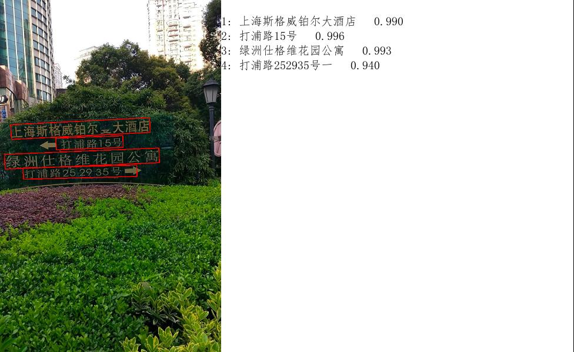
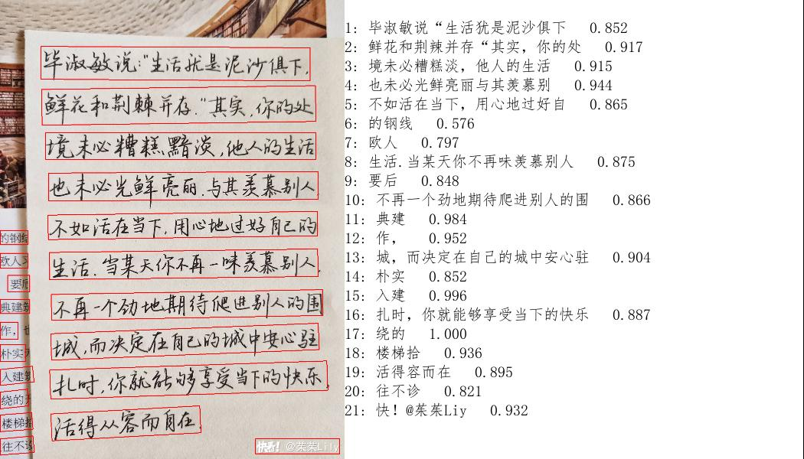

# PPOCRv5
PPOCRv5 DEMO on Axera

- 目前支持  Python 语言 
- 预编译模型下载[models](https://github.com/wangli-coder/PPOCR_v5/releases/download/V1.0.0/models.zip), 如需自行转换请参考[模型转换](./model_convert/README.md)
- PPOCRv5相关资料：[PP-OCRv5](https://github.com/PaddlePaddle/PaddleOCR/blob/main/docs/version3.x/algorithm/PP-OCRv5/PP-OCRv5.md)

## 更新

- [2025-07-10] 推理代码更新，量化config和模型更新
- [2025-07-09] 630C平台量化相关config和模型更新
- [2025-07-03] Onnx和650N推理平台代码、量化相关config和模型上传

## 支持平台

- [x] AX650N
- [x] AX630C

## 模型转换

[模型转换](./model_convert/README.md)

## 上板部署（650N）

- AX650N 的设备已预装 Ubuntu22.04
- 以 root 权限登陆 AX650N 的板卡设备
- 链接互联网，确保 AX650N 的设备能正常执行 `apt install`, `pip install` 等指令
- 已验证设备：AX650N DEMO Board

### Python API 运行

#### Requirements

```
cd python
pip3 install -r requirements.txt
``` 

#### 运行

##### 基于 ONNX Runtime 运行  
可在开发板或PC运行 

在开发板或PC上，运行以下命令  
```  
cd python
python3 main.py --det_model [your onnx detmodel path] --cls_model [your onnx clsmodel path] --rec_model [your onnx recmodel path] --engine onnx --source [your image path]
```
输出示例


##### 基于AXEngine运行  
在开发板上运行命令

```
cd python  
python3 main.py --det_model [your ax detmodel path] --cls_model [your ax clsmodel path] --rec_model [your ax recmodel path] --engine ax --source [your image path]
```  
输出示例



运行参数说明:  
| 参数名称 | 说明  |
| --- | --- | 
| --det_model | 检测模型路径 | 
| --cls_model | 方向分类模型路径 | 
| --rec_model | 识别模型路径 | 
| --det_input_shape | 检测模型输入尺寸 | 
| --cls_input_shape | 方向分类模型输入尺寸 | 
| --rec_input_shape | 识别模型输入尺寸 | 
| --source | 输入图片路径 |
| --engine | 推理引擎 |
| --character_dict_path | 识别字典路径 |

### Latency

#### AX650N

| model | latency(ms) |
|---|---|
|PP-OCRv5_mobile_det|28.616|
|PP-LCNet_x0_25_textline_ori|0.210|
|PP-OCRv5_mobile_rec|3.623|

#### AX630C

| model | latency(ms) |
|---|---|
|PP-OCRv5_mobile_det|123.094|
|PP-LCNet_x0_25_textline_ori|0.394|
|PP-OCRv5_mobile_rec|20.182|

## 技术讨论

- Github issues
- QQ 群: 139953715

## 参考
- https://github.com/jingsongliujing/OnnxOCR
- https://github.com/PaddlePaddle/PaddleOCR
